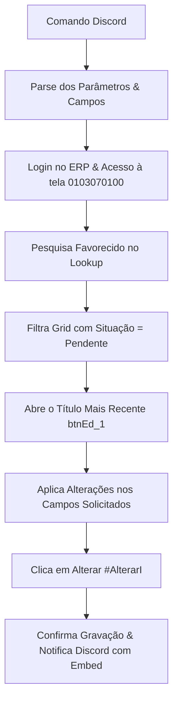
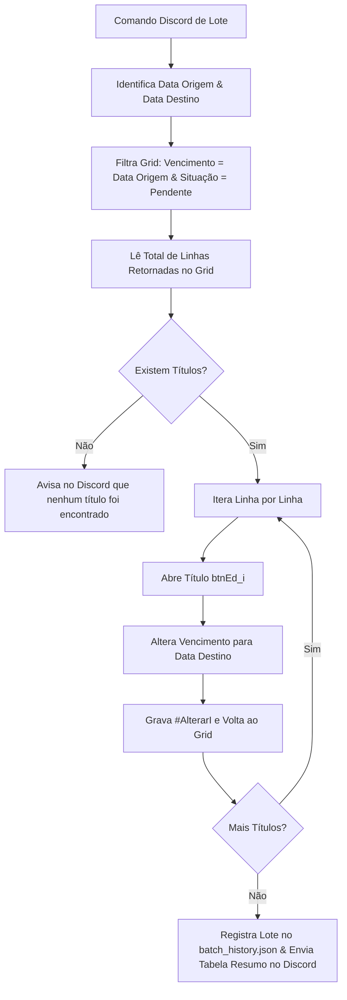

# Módulo de Alteração de Títulos a Pagar (ERP ADMSIS)

Este documento especifica a arquitetura técnica, os seletores da tela **0103070100 (Financeiro / Títulos a Pagar)**, os fluxos operacionais e os comandos do Discord para o job **`alteracao`**.

---

## 1. Mapeamento dos Campos da Tela 0103070100

A tela de edição de títulos a pagar (`Action=FICHA` dentro do iframe `frmTela103070100`) possui os seguintes elementos validados no DOM:

| Campo | Seletor no DOM | Tag HTML | Tipo de Entrada | Regra de Manipulação |
|---|---|---|---|---|
| **Plano de Contas** | `#ttp_plano_conta_id` | `<select>` | `select-one` | O texto da opção segue o padrão `CÓDIGO-DESCRIÇÃO` (ex: `41038-...` ou `41607-IMPOSTO PREDIAL`). Pode ser selecionado pelo código numérico ou por substring na descrição. |
| **Filial** | `#ttp_filial_id` | `<select>` | `select-one` | Seleciona pelo código interno mapeado (`429` ➔ `155`, `601` ➔ `216`, `551` ➔ `161`, `302` ➔ `253`, `NEVINE` ➔ `293`, `RELEVO` ➔ `154`). |
| **Referência** | `#ttp_referencia` | `<input>` | `text` | Preenche o texto com `.fill(ref)` e dispara evento `change`. |
| **Data de Vencimento** | `#ttp_data_vencimento` | `<input>` | `text` | Formato `DD/MM/AAAA`. Preenche o valor e dispara eventos `change` e `blur`. |
| **Fornecedor / Favorecido** | `#pesq_ttp_fornecedor_id` + `#ttp_fornecedor_id` | `<input>` | `text` + `hidden` + Lookup | Utiliza o botão de lookup `#btnLookupJanela_ttp_fornecedor_id` para selecionar no `EngAjaxLookup` com confirmação. |
| **Observação** | `#ttp_observacao` | `<textarea>` | `textarea` | Campo multilinha. Atualiza via `.fill(obs)`. |
| **Valor do Título** | `#ttp_valor_titulo` | `<input>` | `text` | Formato moeda brasileira (ex: `1.250,00`). |
| **Botão Gravar** | `#AlterarI` / `button:has-text("Alterar")` | `<button>` | Ação de envio | Grava as alterações no banco com clique seguro (`no_wait_after=True`). |

---

## 2. Casos de Uso e Comandos Suportados no Discord

### A. Alteração Pontual (Um Favorecido)

Permite atualizar um ou mais campos específicos do título em aberto mais recente do favorecido:

1. **Alterar Plano de Contas:**
   > `@SofIA altere o plano de contas do favorecido Eduardo Laurindo para 41038`
2. **Alterar Data de Vencimento:**
   > `@SofIA altere a data de vencimento do favorecido Eduardo Laurindo para 01/10/2026`
   > *(Suporta também termos relativos como `para hoje` ou `para amanhã`)*
3. **Alterar Filial:**
   > `@SofIA altere a filial do favorecido Eduardo Laurindo para 601`
4. **Alterar Referência:**
   > `@SofIA altere a referencia do favorecido Eduardo Laurindo para SERVIÇOS SETEMBRO`
5. **Alterar Observação:**
   > `@SofIA altere a observação do favorecido Eduardo Laurindo para Boleto renegociado via WhatsApp`
6. **Alteração Combinada (Múltiplos Campos):**
   > `@SofIA altere o favorecido Eduardo Laurindo: vencimento 05/10/2026, plano 41038, filial 429`

---

### B. Alteração em Lote (Batch Update por Data de Vencimento)

Permite prorrogar ou alterar o vencimento de todos os títulos que vencem em determinada data:

1. **Alterar todos que vencem hoje:**
   > `@SofIA altere a data de vencimento de TODOS os favorecidos de HOJE para 01/10/2026`
2. **Alterar por data de origem explícita:**
   > `@SofIA altere a data de vencimento de TODOS os títulos de 30/09/2026 para 05/10/2026`
3. **Alterar com filtro de filial:**
   > `@SofIA altere o vencimento de TODOS da filial 429 de hoje para amanhã`

---

## 3. Fluxo de Execução Técnica (Playwright RPA)

### Fluxo 1: Alteração Individual

### Fluxo 2: Alteração em Lote

---

## 4. Sugestões de Melhorias & Melhores Práticas Recomendadas

1. **Filtro Estrito por Situação (`Pendente`):**
   - Títulos já baixados ou cancelados não devem ter vencimento ou plano alterados. O robô sempre aplica o filtro `Situação = Pendente` no grid antes de qualquer alteração.
2. **Confirmação com Preview para Operações em Lote:**
   - Quando o comando envolver a palavra `TODOS`, o bot pode primeiro fazer a contagem:
     > *"Encontrei 7 títulos pendentes que vencem hoje somando R$ 14.280,00. Deseja alterar o vencimento de todos para 01/10/2026? Clique em Confirmar."*
   - Isso evita acidentes operacionais caso o usuário tenha digitado a data errada.
3. **Busca Flexível de Plano de Contas:**
   - Se o usuário digitar o código numérico (ex: `41038`), o robô busca por `opt.text.startsWith('41038')`.
   - Se digitar o nome (ex: `OUTRAS DESPESAS`), o robô busca por `OUTRAS DESPESAS` no texto de todas as `<option>`.
4. **Registro de Auditoria:**
   - Cada alteração é gravada em `data/batch_history.json` com o tipo `ALTERACAO_TITULO` ou `ALTERACAO_LOTE`, guardando o valor antes e depois para histórico de conformidade.
